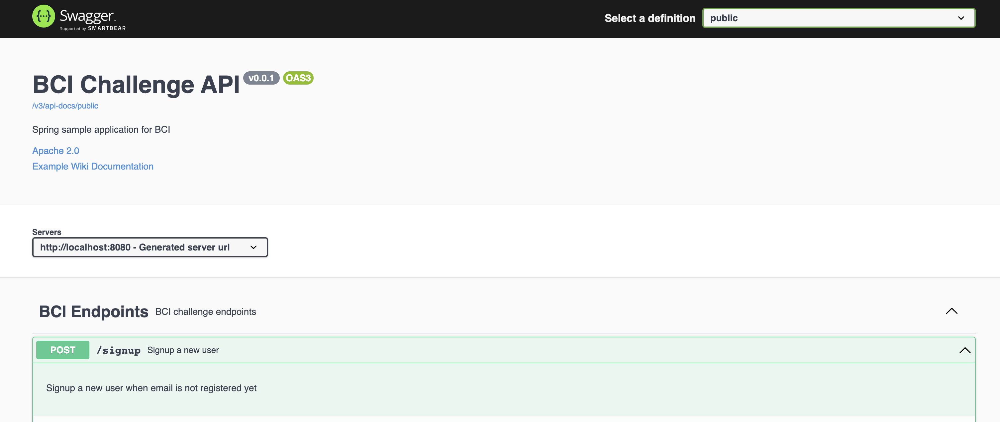
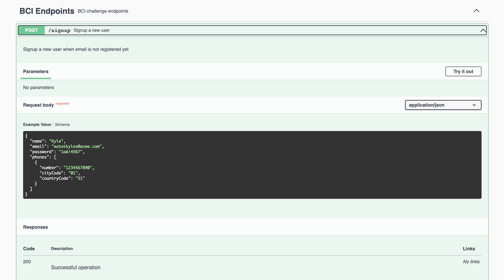

# BCI Code Challenge

API Restful que expone la creación de usuarios. \
Este es un desafio en el proceso de aplicación al [Banco BCI](https://www.bci.cl/personas).



# TO DO.

- Actualizar README.md

# Funcionalidades

- Registro de nuevos usuarios usando Spring Data JPA
- Pruebas unitarias y cobertura de código
- Integración de Spring Boot con Swagger 3.0
- Uso de base de datos en memoria.

# ¿Cómo ejecutar la aplicación?

La aplicación usa [Gradle](https://gradle.org/) para la compilación y arranque del proyecto. Dentro del proyecto viene el cliente de Gradle para realizar la ejecución de las tareas.

Una vez descargado el proyecto en la máquina local ejecutar el siguiente comando para ejecutar la tarea de arranque.

```(shell)
./gradlew bootRun
```

Una vez realizado el arranque de la aplicación dirigirse al siguiente [link](http://localhost:8080/swagger-ui/index.html) para visualizar el cliente swagger de la aplicación.



## References

- [Exception handling in Spring](https://spring.io/blog/2013/11/01/exception-handling-in-spring-mvc)
- [Global error handling in a Spring REST API](https://www.baeldung.com/global-error-handler-in-a-spring-rest-api)
- [Jackson ignore null fields](https://www.baeldung.com/jackson-ignore-null-fields)
- [Spring Boot application properties](https://docs.spring.io/spring-boot/docs/current/reference/html/application-properties.html)
- [Spring validation and custom patterns](https://stackoverflow.com/questions/49887489/java-spring-validation-and-custom-patterns)
- [Spring Boot testing log level](https://www.baeldung.com/spring-boot-testing-log-level)
